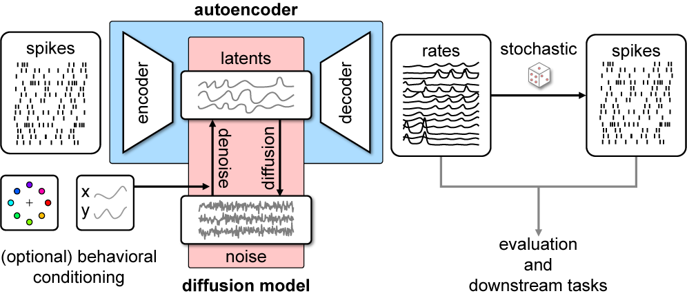

# Latent Diffusion for Neural Spiking Data




This repository contains research code for the NeurIPS 2024 Spotlight paper:   
 [***Latent Diffusion for Neural Spiking Data***](https://arxiv.org/abs/2407.08751)   
 by [Kapoor*](https://jkapoor.me), [Schulz*](https://www.linkedin.com/in/auguste-schulz-b5a57a168/), [Vetter](https://www.linkedin.com/in/julius-vetter-060ab11b8?originalSubdomain=de), [Pei](https://www.linkedin.com/in/felix-pei-b41742196/), [Gao†](https://www.rdgao.com), and [Macke†](https://mackelab.org) (2024).


## Installation

To run the scripts make sure to first install all the requirements. We recommend creating a conda environment first.
A GPU is recommend but not necessary.

```bash 
git clone git@github.com:mackelab/LDNS.git
cd LDNS
conda create --name ldns python=3.9
conda activate ldns
pip install -e . # install from requirements.txt
# optional: install jupyter notebook
pip install jupyter
```

### Downloading human and monkey data

If you want to run the experiments on the human and monkey data, download and store the datasets:
- Monkey data: https://dandiarchive.org/dandiset/000128 (download using `dandi download DANDI:000128/0.220113.0400` in `data/monkey`)
- Human data (Willet et al, 2023): https://datadryad.org/stash/downloads/file_stream/2547369 (download in `data/human`, then unzip using `tar -xvf data/human/2547369`)


## Running the experiments

The core model and data loading code is in the [`ldns` directory](ldns). Training and evaluation is done in .ipynb files in the [`notebooks` directory](notebooks).
| Dataset | Train and Evaluate | Notebook |
|---------|-------------------|----------|
| **Lorenz system** | autoencoder | [`notebooks/train_autoencoder_Lorenz.ipynb`](notebooks/train_autoencoder_Lorenz.ipynb) |
| | diffusion model | [`notebooks/train_diffusion_Lorenz.ipynb`](notebooks/train_diffusion_Lorenz.ipynb) |
| **Human BCI data** | autoencoder | `notebooks/train_autoencoder_human.ipynb`|
| | diffusion model | `notebooks/train_diffusion_human.ipynb`|
| **Monkey reach data** <br> | autoencoder | `notebooks/train_autoencoder_monkey.ipynb` |
| | diffusion model (unconditional) | `notebooks/train_diffusion_monkey.ipynb` |
| | diffusion model (angle-conditioned) | `notebooks/train_diffusion_monkey_angle_conditioned.ipynb` |
| | diffusion model (velocity-conditioned) | `notebooks/train_diffusion_monkey_velocity_conditioned.ipynb` |

> **Note**: we are currently cleaning up the notebooks and will update this section soon.

## Baselines for the Lorenz and Monkey Reach Data

In the paper, we compared LDNS to a number of VAE-based baselines. The code for these baselines can be found in the [`baselines` directory](baselines).

> Refactoring and cleaning of the baseline code is in progress. We appreciate your patience!

## Citation

```
@inproceedings{kapoorschulz2024ldns,
	author = {Jaivardhan Kapoor and Auguste Schulz and Julius Vetter and Felix C Pei and Richard Gao and Jakob H. Macke},  
	title = {Latent Diffusion for Neural Spiking Data},  
	journal = {Advances in Neural Information Processing Systems},
	year = {2024}  
}
```
## Contact
Please open a Github issue for any questions, or send an email to jaivardhan.kapoor@uni-tuebingen.de or auguste.schulz@uni-tuebingen.de.
